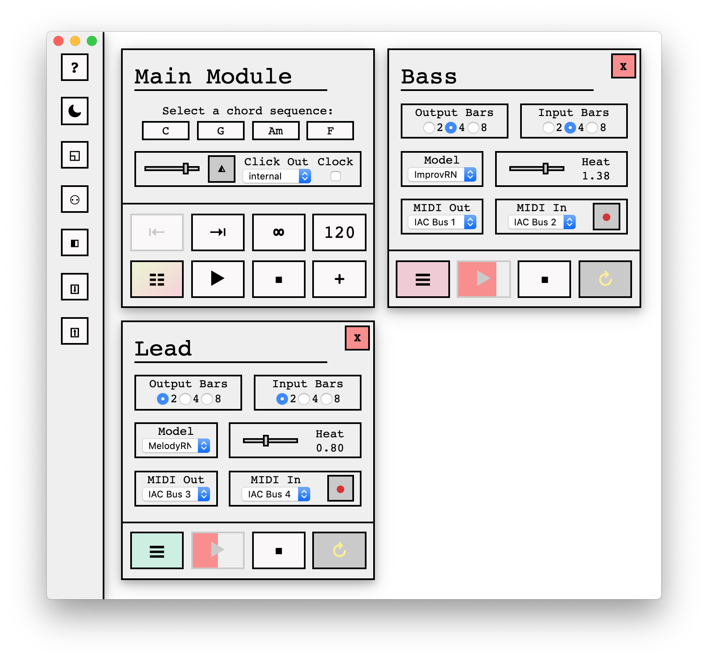

# MMAI Masterthesis Project by Jakob Sudau ([Download](https://github.com/jakobsudau/MMAI/releases))



To install and run:

1. clone this repository
2. open a Terminal in the project directory
3. run following command: yarn installProject
4. for running as Node.js server: in server/node_modules, navigate to @magenta/music/es5/music_rnn/model.js and add following code below the requires and before the MusicRNN class declaration:
```
const fs = require('fs');
const path = require('path');
const nodeFetch = require('node-fetch');
const Request = nodeFetch.Request;
const Response = nodeFetch.Response;

global.fetch = function (url, options) {
    const request = new Request(url, options);
    if (request.url.substring(0, 5) === 'file:') {
        return new Promise((resolve, reject) => {
            const filePath = path.normalize(url.substring('file://'.length));
            if (!fs.existsSync(filePath)) {
                reject(`File not found: ${filePath}`);
            }
            const readStream = fs.createReadStream(filePath);
            readStream.on('open', function () {
                resolve(new Response(readStream, {
                    url: request.url,
                    status: 200,
                    statusText: 'OK',
                    size: fs.statSync(filePath).size,
                    timeout: request.timeout
                }));
            });
        });
    } else {
        return nodeFetch(url, options);
    }
};
```
5. To run project as a Node server, run following command: yarn startNode and navigate to http://localhost:3000
6. To run project as a standalone, run following command: yarn startElectronMac or startElectronWin

